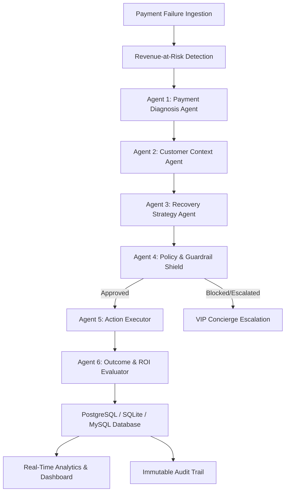

# RazorRecover AI ⚡
### Autonomous AI Payment Revenue Recovery Platform

> Built by **Aryan Koomar** for the **Razorpay AI Buildathon** — *AI Revenue Recovery Track (Track 03)*

[]()
[]()
[]()
[]()
[]()

---

## 📌 Executive Summary

Payment failures cost online merchants and subscription businesses **10% to 15% of annual gross merchandise value (GMV)**. Existing legacy recovery mechanisms rely almost exclusively on naive, hardcoded retry loops: re-attempting identical gateway debits on the exact same rail regardless of whether the failure was caused by an expired card, issuer bank switch downtime, customer balance shortage, or 2FA authentication lapse.

**RazorRecover AI** is an autonomous, multi-agent fintech SaaS platform that transforms payment recovery from a blind retry loop into an intelligent, context-aware, multi-channel decision system.

```
Payment Event → Revenue-at-Risk Detection → AI Diagnosis → Customer Context → AI Recovery Strategy → Policy Guardrails → Action Executor → Outcome & ROI → Audit Trail
```

---

## 🎯 The Core Workflow: 6 Autonomous AI Agents



### 1. Payment Diagnosis Agent
- Ingests Razorpay error codes (`GATEWAY_TIMEOUT`, `INSUFFICIENT_FUNDS`, `AUTHENTICATION_FAILED`, `EXPIRED_CARD`, `BANK_DEEMED_HIGH_RISK`, etc.).
- Evaluates live issuer banking switch health (HDFC, SBI, ICICI, Axis, NPCI UPI rails).
- Categorizes failure into 6 root cause archetypes with statistical confidence metrics.

### 2. Customer Context Agent
- Evaluates customer lifetime value (LTV), past settlement success rate (e.g. 12/13 settled), preferred payment methods (UPI VPAs, tokenized cards), and active communication channels.
- Calculates **Contact Fatigue Risk** to prevent spamming customers.

### 3. Recovery Strategy Agent & Scoring Matrix
- Dynamically scores 7 possible recovery interventions based on expected value:
$$\text{Expected Value} = \text{Amount} \times P(\text{Recovery}) - \text{Friction Cost}$$
- Selects the winning strategy:
  1. **Smart NPCI Retry** (Sub-second silent backoff for transient packet drops)
  2. **Dynamic Payment Link** (Hosted 1-click checkout dispatched via WhatsApp / SMS)
  3. **Payment Method Recommendation** (Prompts user to switch from failing Card to verified UPI)
  4. **Scheduled Delayed Retry** (Queued for 30–45 mins during active core banking downtime)
  5. **Personalized WhatsApp Nudge** (Tailored reminder template for high-intent abandoned checkouts)
  6. **VIP Ops Escalation** (Transfers high-value ₹50k+ payments to concierge desk)
  7. **Suppression / No Action** (Stops retries on hard declines or fatal fraud triggers)

### 4. Guardrail & Policy Engine (Safety Shield)
- Enforces strict fintech stopping rules:
  - **Max 3 Retries** hard cap across all channels.
  - **TRAI Quiet Hours Suppression** (10:00 PM – 08:00 AM IST) for non-urgent notifications.
  - **Minimum 35% Recovery Probability Floor**.
  - **Mandatory Human Sign-off** on high-value transactions ($\ge$ ₹50,000).

### 5. Action Executor
- Dispatches concrete recovery actions through modular payment providers.
- Emits real-time telemetry and tracks execution latency.

### 6. Outcome & Incremental ROI Evaluator
- Verifies post-intervention settlement.
- Quantifies **Incremental Lift** over baseline naive retries ($+42.0\%$ recovery rate expansion, $+₹6.25\text{L}$ recovered per 500 failed checkouts).

---

## 🏗️ Architecture & Technology Stack

| Layer | Technology |
|---|---|
| **Frontend** | Next.js 14 App Router, React 18, Tailwind CSS, Lucide Icons, Recharts, Framer Motion, 3D Canvas Visualizer |
| **Backend & APIs** | Next.js Server Route Handlers, Zod Validation, JWT Auth, Bcrypt |
| **Database & ORM** | Prisma ORM, SQLite (`prisma/dev.db`), MySQL (`prisma/schema.mysql.prisma`), PostgreSQL |
| **AI / ML Layer** | Multi-Agent Orchestrator, Statistical ML Propensity Model, GenAI Recovery Copywriter (Gemini / Neural Fallback) |
| **Testing** | Node.js Test Runner (17 unit, integration, and persistence tests) |

---

## ⚡ Quickstart & Local Setup

```bash
# 1. Install dependencies
npm install

# 2. Run database migrations & seed demo data
npx prisma generate
npx tsx prisma/seed.ts

# 3. Start development server
npm run dev
# Open http://localhost:3000
```

---

## 🧪 Testing

Run the full automated test suite (17 tests covering Agents, Propensity ML, Guardrails, Simulations, Auth, and Database Persistence):

```bash
npm test
```

---

## 🛡️ Sandbox & Synthetic Data Notice
*RazorRecover AI uses realistic synthetic payment telemetry modeling Indian fintech rails (NPCI UPI handles, bank error codes, Card tokenization). It does not require or access live Razorpay merchant customer data.*

---

## 📄 License
MIT License. Built by **Aryan Koomar** for the Razorpay AI Buildathon 2026.
